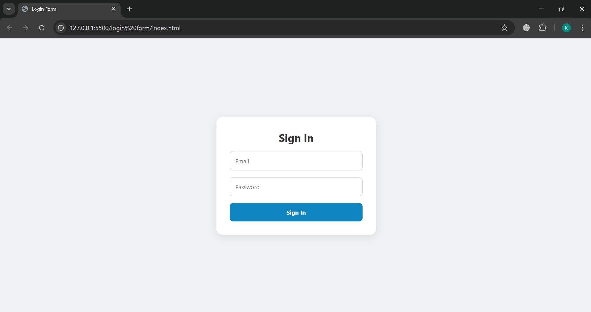
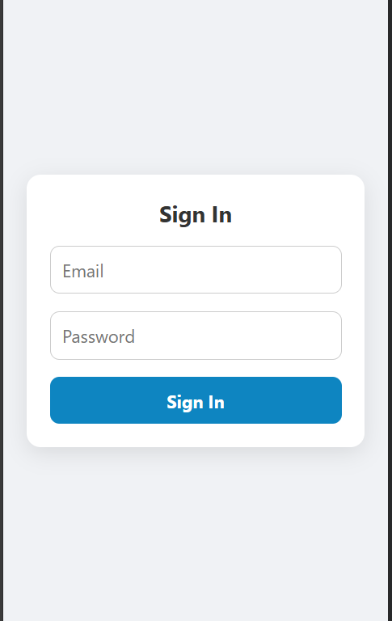

# Responsive Login Form – HTML + CSS (Flexbox)

A clean and responsive login form built using pure HTML and CSS, ideal for beginners to understand form styling, layout with Flexbox, and responsive design.

## 🚀 Features
- Fully responsive (mobile + desktop)
- Centered form using Flexbox
- Styled inputs and button with hover effect
- Smooth focus transitions
- Error message placeholder (can be shown via JS)

## 📁 Files
- index.html – structure of the login form
- style.css – styling with Flexbox and media responsiveness

## 💡 How to Use
1. Clone or download the repo
2. Open index.html in your browser
3. Customize the form as per your project needs

## 📱 Mobile-Friendly
Uses media queries and max-width to ensure smooth layout on mobile devices.

## Screenshot

## Mobile View Screenshot

## 🔧 To Improve
- Add JavaScript validation
- Toggle error message
- Connect with backend (e.g., Firebase, Node.js)
